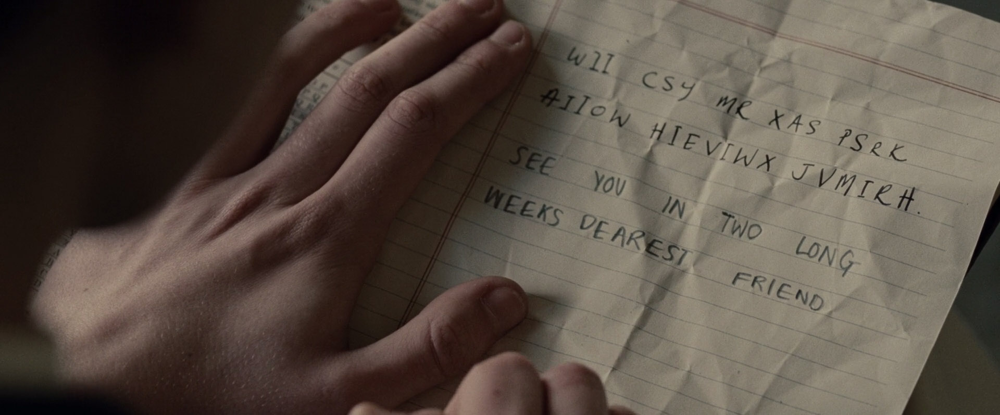

# Cryptography Repository

The aim of this repository is register some notes about cryptography, and algorithms implementations of cryptography. We'll use Java for algorithm implementation, but you can translate for any language of your choice.

## What is Cryptography?

Imagine a situation where