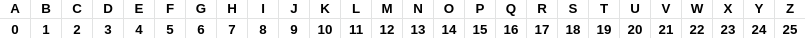

### Shift Cipher

O Shift Cipher *cryptosystem* é um sistema de criptografia definido sobre o anel  . Para codificar uma palavra nesse sistema devemos converter os caracteres formadores da palavra em seus respectivos valores numéricos através da seguinte relação:

<p style="align:center">
	<center><center>
</p>

Após converter cada caracter em seu valor numérico, o método Shift Cipher irá somar o valor do shift ao valor numérico, obtendo assim, o valor correspondente a um outro caracter. Aqui é **importantíssimo** observar que, estamos olhando os números de 0 até 25 como elementos do anel , e não como elementos de .

#### Exemplo 
Se a palavra a ser codificada é "criptografia", e o valor do shift é 10, então o resultado será: "mbszdyqbkpsk". pois a sequência de caracteres "c r i p t o g r a f i a" é equivalente à sequência numérica "2 17 8 15 19 14 6 17 0 5 8 0" e somando 10 a cada termo dessa sequência obtemos: "12 27 18 25 29 24 16 27 10 15 18 10", entretanto, como observado acima, estamos no anel , logo esta última sequência é equivalente a "12 1 18 25 3 24 16 1 10 15 18 10", que por sua vez é equivalente à sequência alfabética "m b s z d y q b k p s k".

#### Implementação

No arquivo *[ShiftFunction.java](ShiftFunction.java)* encontramos o núcleo do algoritmo. A classe ShiftFunction possui o método shift, que recebe como parâmetros uma string e um inteiro

``` java
// Método para fazer o shift
public static StringBuffer shift(String text, int s){
	
	// Cria o objeto result da classe StringBuffer
	StringBuffer result = new StringBuffer();
		
	// Início do laço para varrer os caracteres da String recebida
	for(int i = 0; i < text.length(); i++){

		//Caso o caractere for maiúsculo
		if(Character.isUpperCase(text.charAt(i))){
			//ch recebe o valor do character encriptado
			char ch = (char)(((int)text.charAt(i) + s - 65)%26 + 65);
			//A StringBuffer result é atualizada concatenando o valor de ch
			result.append(ch);
		}
		//Caso o caractere for minúsculo
		else{
			//ch recebe o valor do character encriptado
			char ch = (char)(((int)text.charAt(i) + s - 97)%26 + 97);
			//A StringBuffer result é atualizada concatenando o valor de ch
			result.append(ch);
	}
	//retorna a mensagem criptografada
	return result;
}
```

