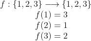
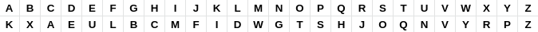

### Substitution Cipher

Uma permutação é definida como uma função bijetora cujo domínio coincide com o contradomínio.

#### Exemplo de permutação

<p align="center">

  

</p>


O *Substitution Cipher Cryptosystem* faz uso de uma permutação do alfabeto para encriptar mensagens.

#### Implementação

Todo a implementação do método está presente no arquivo [SubstitutionCipherClass.java](SubstitutionCipherClass.java).

```Java

// Cria Array contendo as letras do alfabeto de maneira ordenada
char plainText[] = {'a', 'b', 'c', 'd', 'e', 'f', 'g', 'h', 'i', 'j', 'k', 'l', 'm', 'n', 'o', 'p', 'q', 'r', 's', 't', 'u', 'v', 'w', 'x', 'y', 'z'};
        
// Cria Array contendo as letras do alfabeto de maneira permutada
char cipherText[] = {'k', 'x', 'a', 'e', 'u', 'l', 'b', 'c', 'm', 'f', 'i', 'd', 'w', 'g', 't', 's', 'h', 'j', 'o', 'q', 'n', 'v', 'y', 'r', 'p', 'z'};

// Cria a string de teste para realizar o SubstitutionCipher
String text = "abcdefghijklmnopqrstuvwxyzABCDEFGHIJKLMNOPQRSTUVWXYZ";

System.out.printf("%nabcdefghijklmnopqrstuvwxyzABCDEFGHIJKLMNOPQRSTUVWXYZ%n");

// Inicia laço para varrer os caracteres da string de teste
for (int a = 0; a < text.length(); a++) {
            
  // Inicia laço para varrer o array plainText
  for (int i = 0; i < plainText.length; i++) {
               
    // Verifica se o a-ésimo caractere da string teste é maiúsculo
    if(Character.isUpperCase(text.charAt(a))){

      /* 
        Verifica se o i-ésimo caractere do array plainText
        é igual ao a-ésimo caractere da string teste através
        da numeração ASCII correspondente
      */
      if((int)plainText[i] == ((int)text.charAt(a) + 32)){

        System.out.print((char)((int)cipherText[i] - 32));
                    
      }
            
    }
    else{

      if(plainText[i] == (text.charAt(a))){

        System.out.print(cipherText[i]);
      }
                    
    }
            
  }   
}

```
Inicialmente criamos dois arrays, um contendo os caracteres do alfabeto na ordem lexicográfica, e outro contendo uma permutação dos caracteres do alfabeto.

```Java
char plainText[] = {'a', 'b', 'c', 'd', 'e', 'f', 'g', 'h', 'i', 'j', 'k', 'l', 'm', 'n', 'o', 'p', 'q', 'r', 's', 't', 'u', 'v', 'w', 'x', 'y', 'z'};
        
char cipherText[] = {'k', 'x', 'a', 'e', 'u', 'l', 'b', 'c', 'm', 'f', 'i', 'd', 'w', 'g', 't', 's', 'h', 'j', 'o', 'q', 'n', 'v', 'y', 'r', 'p', 'z'};
```

Podemos escolher qualquer uma dentre as 26! permutações (é interessante que não seja a permutação trivial). Para este exemplo a permutação escolhida foi

<p align="center">

  

</p>  

Criamos um objeto string, que será utilizado para testar a implementação:
```Java
String String text = "abcdefghijklmnopqrstuvwxyzABCDEFGHIJKLMNOPQRSTUVWXYZ";
```
Em seguida iniciamos um laço, que irá varrer a String text e aplicar a criptografia.

```Java
for (int a = 0; a < text.length(); a++) {

  for (int i = 0; i < plainText.length; i++) {

    if(Character.isUpperCase(text.charAt(a))){

      if((int)plainText[i] == ((int)text.charAt(a) + 32)){

        System.out.print((char)((int)cipherText[i] - 32));
                    
      }            
    }
    else{

      if(plainText[i] == (text.charAt(a))){

        System.out.print(cipherText[i]);
      }
                    
    }
            
  }   
}

```
O laço percorre a String 'text' e, para cada caractere fixado, um novo laço interno percorre os caracteres no array 'plainText'. Dentro do laço interno, verificamos se o caractere fixado em 'text' é maiúsculo ou minúscolo. Se é maiúsculo então, utilizando a codificação do ASCII, comparamos o valor inteiro do caractere, acrescido de 32 (conversão para minúsculo), com o valor inteiro de cada caractere em plainText. Quando, para algum 'i' entre 0 e 26, os valores coincidirem, então teremos que o caractere fixado em 'text' é correspondente ao caractere na posição 'i', logo o resultado da encriptação é o caractere na posição 'i' do array 'cipherText'. No caso em que o caractere fixado é minúsculo, o processo ocorrerá de forma semelhante, porém sem fazer conversões na tabela ASCII.