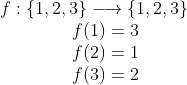

### Substitution Cipher

Uma permutação é definida como uma função bijetora cujo domínio coincide com o contradomínio.

#### Exemplo

	

O *Substitution Cipher Cryptosystem* faz uso de uma permutação do alfabeto para encriptar mensagens.